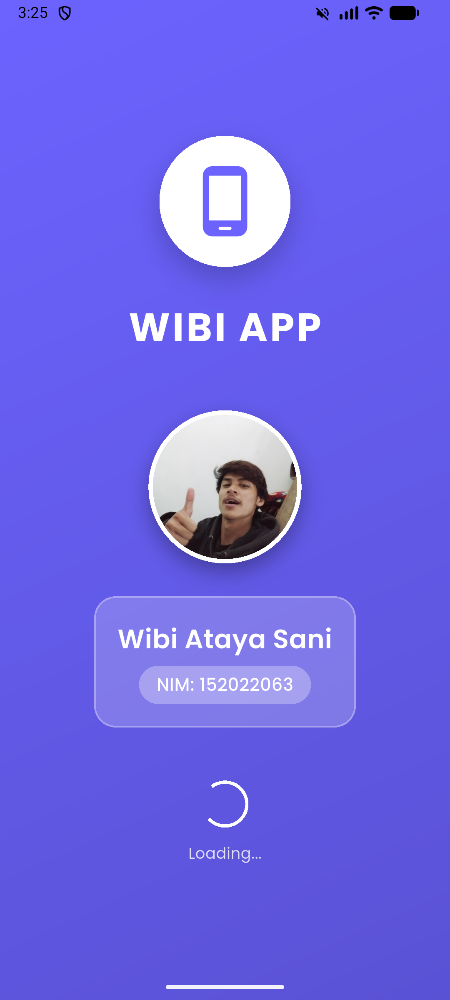
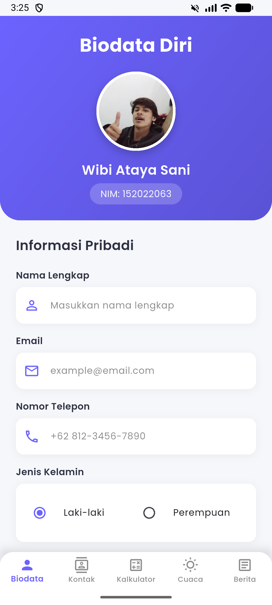
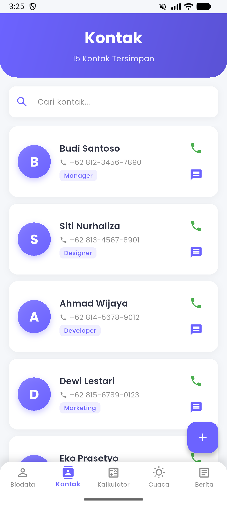
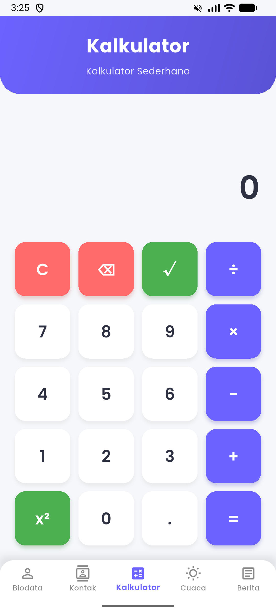
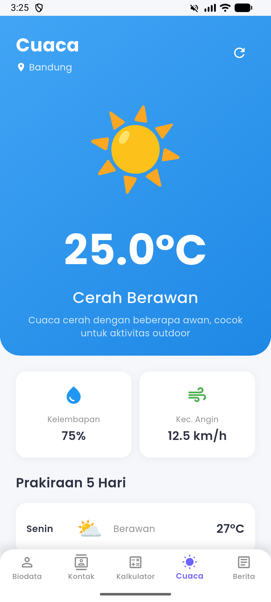
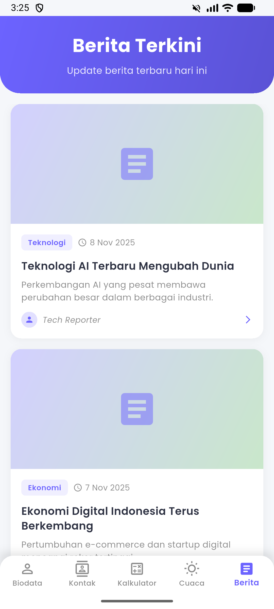

# WIBI APP - Flutter Mobile Application


Aplikasi mobile Flutter lengkap dengan 7 halaman utama yang mencakup Splash Screen, Biodata, Kontak, Kalkulator, Cuaca, dan Berita.

---

## 📖 About / Tentang Aplikasi

**WIBI APP** adalah aplikasi mobile cross-platform yang dibangun menggunakan Flutter framework. Aplikasi ini dirancang dengan konsep modern UI/UX dan mengimplementasikan berbagai fitur fundamental yang umum digunakan dalam pengembangan aplikasi mobile.

### Tujuan Aplikasi

Aplikasi ini dikembangkan sebagai project pembelajaran untuk memahami dan mengimplementasikan berbagai komponen penting dalam pengembangan aplikasi mobile, termasuk:

- Navigation pattern (Bottom Navigation Bar)
- Form handling dengan berbagai input types
- List view dengan data statis
- Mathematical operations
- Layout design yang responsive dan estetik

### Teknologi yang Digunakan

- **Flutter SDK 3.9.2+** - Framework utama untuk cross-platform development
- **Dart Programming Language** - Bahasa pemrograman yang digunakan
- **Google Fonts Package** - Untuk custom typography (Poppins font)
- **Material Design 3** - Design system untuk konsistensi UI/UX
- **Intl Package** - Untuk formatting tanggal dan internasionalization

### Arsitektur Aplikasi

Aplikasi ini menggunakan struktur yang terorganisir dengan pemisahan concerns:

- **Models** - Untuk data structure dan business logic
- **Screens** - Untuk UI components dan presentation layer
- **Utils** - Untuk constants, helpers, dan shared utilities
- **Widgets** - Untuk reusable UI components

---

## 📸 Screenshots & Deskripsi Halaman

### 1. Splash Screen



**Deskripsi:**
Halaman pertama yang muncul saat aplikasi dibuka. Splash screen ditampilkan selama 5 detik dengan animasi yang smooth. Halaman ini menampilkan identitas mahasiswa lengkap dengan foto profile, nama, dan NIM yang dikemas dalam desain gradient purple yang modern dan profesional.

**Fitur:**

- Logo aplikasi di bagian atas dengan background circle white
- Foto profile mahasiswa dengan border white dan shadow effect
- Nama mahasiswa dengan typography yang jelas
- NIM dalam badge dengan background semi-transparent
- Loading indicator di bagian bawah
- Fade-in & Scale animation untuk smooth transition
- Auto-redirect ke Dashboard setelah 5 detik

**Teknologi:**

- `AnimationController` untuk kontrol animasi
- `FadeTransition` dan `ScaleTransition` untuk efek visual
- `Timer` untuk countdown 5 detik
- Gradient background menggunakan `LinearGradient`

---

### 2. Dashboard dengan Bottom Navigation


**Deskripsi:**
Halaman utama aplikasi yang menggunakan Bottom Navigation Bar dengan 5 menu utama. Dashboard mengimplementasikan fragment concept dimana setiap menu menampilkan halaman yang berbeda tanpa reload ulang aplikasi. Navigation bar menggunakan design rounded top corners dengan shadow effect untuk memberikan kesan floating.

**Fitur:**

- Bottom Navigation Bar dengan 5 menu (Biodata, Kontak, Kalkulator, Cuaca, Berita)
- Active dan inactive state dengan color differentiation
- Icon outline untuk inactive, filled untuk active state
- Smooth transition menggunakan `IndexedStack`
- Custom styling dengan rounded top corners
- Shadow effect untuk depth perception
- Google Fonts (Poppins) untuk consistent typography

**Teknologi:**

- `BottomNavigationBar` widget untuk navigation
- `IndexedStack` untuk efficient screen switching tanpa rebuild
- Material Design 3 components
- Custom theme dengan color scheme consistency

---

### 3. Halaman Biodata



**Deskripsi:**
Halaman form biodata yang comprehensive dengan berbagai jenis input field. Halaman ini menampilkan foto profile di header dengan gradient background, diikuti dengan form yang lengkap untuk mengisi data pribadi. Design menggunakan card-based layout dengan shadow dan rounded corners untuk memberikan kesan modern dan clean.

**Fitur:**

- **Header Section** dengan gradient background purple
  - Foto profile dengan circle border dan shadow
  - Nama dan NIM mahasiswa
- **Form Section** dengan berbagai input types:
  - **Text Fields**: Nama Lengkap, Email, Nomor Telepon
  - **Radio Buttons**: Jenis Kelamin (Laki-laki/Perempuan)
  - **Date Picker**: Tanggal Lahir dengan calendar popup
  - **Dropdown**: Pendidikan Terakhir (SMA, D3, S1, S2, S3)
  - **Text Area**: Alamat (multiline input)
- Submit button dengan elevation dan ripple effect
- Form validation (basic)
- Snackbar notification saat submit
- Icons untuk setiap text field
- Consistent spacing dan padding

**Teknologi:**

- `TextFormField` dengan custom decoration
- `RadioListTile` untuk gender selection
- `showDatePicker` untuk calendar dialog
- `DropdownButton` untuk education level
- Form validation menggunakan `GlobalKey<FormState>`
- `DateFormat` dari intl package untuk format tanggal

---

### 4. Halaman Kontak



**Deskripsi:**
Halaman daftar kontak yang menampilkan 15 kontak dengan layout yang menarik. Setiap kontak ditampilkan dalam card dengan circle avatar, informasi lengkap, dan action buttons. Dilengkapi dengan search bar di bagian atas untuk mencari kontak dan floating action button untuk menambah kontak baru.

**Fitur:**

- **Header** dengan gradient background dan counter total kontak
- **Search Bar** dengan icon search dan hint text
- **Contact List** dengan 15 kontak statis:
  - Circle avatar dengan gradient background
  - Fallback ke initial letter jika foto tidak ada
  - Nama kontak dengan typography bold
  - Nomor telepon dengan icon
  - Badge role/jabatan dengan color accent
  - Action buttons (Call & Message)
- **Floating Action Button** untuk add contact
- Card design dengan shadow dan rounded corners
- Inkwell ripple effect saat di-tap
- Scrollable list dengan smooth scrolling

**Data yang Ditampilkan:**
Setiap kontak memiliki: Name, Phone Number, Image Path, dan Role (Manager, Designer, Developer, dll)

**Teknologi:**

- `ListView.builder` untuk efficient rendering
- `CircleAvatar` dengan gradient decoration
- `Material` dan `InkWell` untuk tap effects
- Custom contact model dengan static data
- Icon buttons untuk actions

---

### 5. Halaman Kalkulator



**Deskripsi:**
Kalkulator sederhana namun fungsional dengan design yang clean dan modern. Menggunakan color coding untuk membedakan jenis button (numbers, operators, special functions). Display result menggunakan font size besar untuk readability dan support untuk operasi matematika dasar hingga advanced.

**Fitur:**

- **Display Area** dengan font size 48px
  - Menampilkan input dan hasil perhitungan
  - Auto-formatting untuk decimal numbers
  - Ellipsis untuk angka yang terlalu panjang
- **Operation Buttons**:

  - Basic: Addition (+), Subtraction (-), Multiplication (×), Division (÷)
  - Advanced: Square (x²), Square Root (√)
  - Special: Clear (C), Backspace (⌫), Equals (=), Decimal (.)
  - Number buttons: 0-9

- **Color Coding**:

  - White background untuk angka
  - Purple untuk operators (+, -, ×, ÷, =)
  - Red untuk clear & backspace
  - Green untuk advanced functions (x², √)

- Real-time calculation
- Error handling untuk division by zero
- Error handling untuk square root negative numbers
- Automatic decimal formatting

**Teknologi:**

- State management dengan `setState`
- Mathematical operations menggunakan Dart `math` library
- String manipulation untuk input handling
- Custom button widget dengan Material design
- Elevation dan shadow effects

---

### 6. Halaman Cuaca



**Deskripsi:**
Halaman informasi cuaca dengan design yang menarik menggunakan gradient background biru. Menampilkan data cuaca statis dengan emoji icon yang besar dan expressive. Dilengkapi dengan informasi detail cuaca dan prakiraan 5 hari ke depan dalam card yang rapi.

**Fitur:**

- **Header Section** dengan gradient blue background:

  - Nama kota dengan location icon
  - Emoji icon cuaca yang besar (120px)
  - Temperature display dengan font size 64px
  - Kondisi cuaca (Cerah Berawan, Hujan, dll)
  - Deskripsi cuaca detail
  - Refresh button

- **Weather Details** (2 cards):
  - Kelembapan (%) dengan water drop icon
  - Kecepatan Angin (km/h) dengan wind icon
- **5-Day Forecast**:
  - Nama hari (Senin - Jumat)
  - Emoji icon kondisi cuaca
  - Temperature
  - Kondisi singkat
- Card-based layout dengan shadow
- Icon yang intuitif dan colorful
- Smooth scrolling

**Data Statis:**

- Kota: Jakarta
- Suhu: 28.5°C
- Kelembapan: 75%
- Kecepatan Angin: 12.5 km/h
- Forecast untuk 5 hari

**Teknologi:**

- Custom weather model dengan static data
- Gradient `BoxDecoration` untuk background
- Icon fonts dan emoji untuk weather icons
- Card widgets dengan elevation
- Row layout untuk horizontal arrangement

---

### 7. Halaman Berita



**Deskripsi:**
Halaman daftar berita terkini dengan layout card yang modern. Setiap artikel ditampilkan dengan image header, kategori badge, judul, preview description, dan informasi author. User dapat tap pada artikel untuk melihat detail lengkap dalam bottom sheet modal.

**Fitur:**

- **Header** dengan gradient background dan subtitle
- **News List** dengan 10 artikel statis:
  - Image thumbnail (800x400px landscape)
  - Kategori badge dengan color accent (Teknologi, Ekonomi, Kesehatan, dll)
  - Timestamp dengan clock icon
  - Judul artikel (max 2 lines dengan ellipsis)
  - Deskripsi preview (max 2 lines)
  - Author info dengan avatar
  - Arrow icon untuk detail
- **Detail Modal** (Bottom Sheet):
  - Full article layout
  - Category badge
  - Full title
  - Author dan timestamp info
  - Article image
  - Full description dengan Lorem Ipsum content
  - Draggable handle untuk close
- Card design dengan image at top
- InkWell ripple effect
- Scrollable list
- Smooth bottom sheet animation

**Kategori Berita:**
Teknologi, Ekonomi, Kesehatan, Pendidikan, Olahraga, Travel, Kuliner, Budaya, Bisnis, Lingkungan

**Teknologi:**

- `ListView.builder` untuk efficient list rendering
- Custom news model dengan static data
- `showModalBottomSheet` untuk detail view
- `ClipRRect` untuk rounded image corners
- Badge widgets untuk categories
- Error builder untuk image loading fallback

---

## 📱 Fitur Utama

### 1. 🚀 Splash Screen

- Durasi 5 detik dengan animasi
- Menampilkan logo aplikasi
- Foto profile mahasiswa
- Nama lengkap dan NIM
- Auto-redirect ke Dashboard

### 2. 👤 Halaman Biodata

- Form input lengkap:
  - Text fields (Nama, Email, Phone, Alamat)
  - Radio buttons (Jenis Kelamin)
  - Date picker (Tanggal Lahir)
  - Dropdown (Pendidikan)
- Validasi form
- UI/UX yang menarik

### 3. 📞 Halaman Kontak

- 15 kontak dengan data statis
- Circle avatar untuk setiap kontak
- Informasi lengkap (Nama, No. HP, Role)
- Search functionality
- Action buttons (Call & Message)

### 4. 🧮 Halaman Kalkulator

- Operasi matematika dasar (+, -, ×, ÷)
- Fungsi advanced (x², √)
- Clear & Backspace
- Real-time calculation
- Responsive button layout

### 5. 🌤️ Halaman Cuaca

- Data cuaca statis
- Informasi lengkap (Suhu, Kelembapan, Kecepatan Angin)
- Emoji icon untuk kondisi cuaca
- Prakiraan 5 hari ke depan
- Gradient design

### 6. 📰 Halaman Berita

- 10 artikel berita statis
- Card layout yang menarik
- Detail artikel di Bottom Sheet
- Kategori berita
- Author & timestamp

## 🎨 Desain

- **Material Design 3** dengan custom theme
- **Google Fonts** (Poppins) untuk typography
- **Gradient backgrounds** yang modern
- **Card-based layout** dengan shadows
- **Rounded corners** dan smooth animations
- **Color scheme** yang konsisten dan eye-catching

## 🛠️ Teknologi

- **Flutter SDK** - Framework utama
- **Dart** - Programming language
- **Google Fonts** - Custom typography
- **Intl** - Date formatting

## 📦 Dependencies

```yaml
dependencies:
  flutter:
    sdk: flutter
  cupertino_icons: ^1.0.8
  google_fonts: ^6.2.1
  intl: ^0.19.0
```

## 🚀 Quick Start

### Prerequisites

- Flutter SDK (3.9.2 atau lebih baru)
- Android Studio / VS Code
- Emulator atau Physical Device

### Installation

1. Clone atau download repository

```bash
cd e:\Bayu\Koding\Joki\Mobile\wibi_app
```

2. Install dependencies

```bash
flutter pub get
```

3. **PENTING:** Update informasi pribadi Anda

   Edit file `lib/utils/constants.dart`:

   ```dart
   static const String studentName = 'Nama Anda';  // Ganti dengan nama Anda
   static const String studentNIM = '123456789';    // Ganti dengan NIM Anda
   ```

4. Tambahkan foto profile (optional)

   Simpan foto di `assets/images/profile.png`

5. Run aplikasi

```bash
flutter run
```

## 📁 Project Structure

```
lib/
├── main.dart                    # Entry point
├── models/                      # Data models
│   ├── contact.dart            # Contact model & data
│   ├── news.dart               # News model & data
│   └── weather.dart            # Weather model & data
├── screens/                     # All app screens
│   ├── splash_screen.dart
│   ├── dashboard_screen.dart
│   ├── biodata_screen.dart
│   ├── contact_screen.dart
│   ├── calculator_screen.dart
│   ├── weather_screen.dart
│   └── news_screen.dart
├── utils/                       # Utilities
│   └── constants.dart          # App constants
└── widgets/                     # Reusable widgets

assets/
├── images/                      # Image assets
│   ├── profile.png             # Your photo
│   └── README.txt              # Image guide
└── icons/                       # Icon assets
```

## 📝 Catatan Penting

1. **Semua data bersifat STATIS** (tidak ada database/API)
2. **Update nama dan NIM** di file constants.dart sebelum run
3. **Foto profile** optional, akan menggunakan placeholder jika tidak ada
4. **Clean code** dengan struktur yang rapi dan mudah di-maintain
5. **Error handling** untuk asset yang tidak ditemukan

## 🎯 Requirements Terpenuhi

✅ a) Splash Screen 5 detik (judul, foto, NIM, nama)  
✅ b) Dashboard dengan Bottom Navigation (5 menu: Biodata, Kontak, Kalkulator, Cuaca, Berita)  
✅ c) Halaman Biodata (form lengkap dengan dropdown, radio, calendar)  
✅ d) Halaman Kontak (15 kontak statis dengan circle image)  
✅ e) Halaman Kalkulator (operasi matematika lengkap)  
✅ f) Halaman Cuaca (data statis dengan animasi)  
✅ g) Halaman Berita (data statis dengan layout berulang)  
✅ Tampilan estetik dan modern  
✅ File terpisah untuk setiap komponen  
✅ Kode bersih dan terstruktur

## 📖 Dokumentasi Lengkap

Untuk panduan lebih detail, lihat:

- [DOKUMENTASI.md](DOKUMENTASI.md) - Dokumentasi lengkap
- [PANDUAN_CEPAT.md](PANDUAN_CEPAT.md) - Quick start guide

## 🐛 Troubleshooting

**Q: Asset tidak ditemukan?**  
A: Pastikan foto ada di folder yang benar atau biarkan (akan muncul placeholder)

**Q: Error setelah pub get?**  
A: Coba `flutter clean` kemudian `flutter pub get` lagi

**Q: Mau ubah warna?**  
A: Edit `lib/utils/constants.dart` bagian Colors

## 👨‍💻 Developer

- **Project:** WIBI APP
- **Type:** Flutter Mobile Application
- **Purpose:** Tugas Kuliah Mobile Programming

## 📄 License

Educational Purpose - Tugas Kuliah

---

**Made with ❤️ using Flutter**

_Update nama dan NIM Anda sebelum menjalankan aplikasi!_
